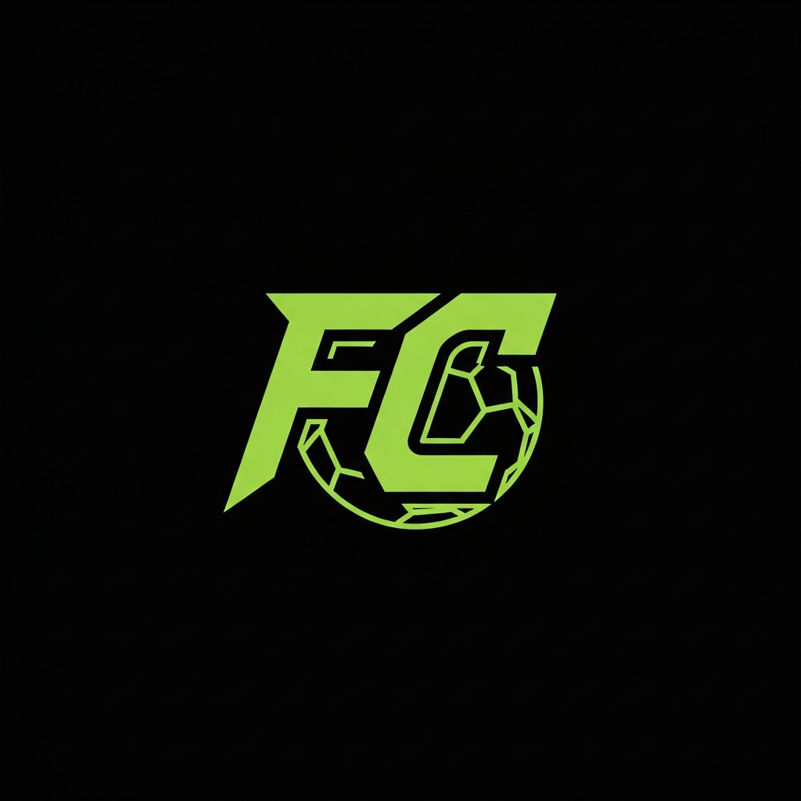

# OMV FC Match Tracker

A sleek, mobile-first web application for tracking EA Sports FC match results among friends (currently branded for FC27). Keep score of your gaming sessions with a beautiful leaderboard, player statistics, and match history.



## Features

- **Leaderboard** - Real-time rankings based on win rate (minimum 3 matches to qualify)
- **Player Statistics** - Track wins, losses, goals scored/conceded, and win/loss streaks
- **Match History** - Complete record of all matches with timestamps
- **Player Management** - Add and remove players from the roster
- **Admin Authentication** - Secure login to manage players and record matches
- **Dark/Light Mode** - Toggle between themes for comfortable viewing
- **Mobile-First Design** - Optimized for phones with sticky navigation
- **Persistent Data** - PostgreSQL database ensures your data survives browser refreshes

## Tech Stack

- **Frontend**: React 19, TypeScript, Tailwind CSS, Zustand
- **Backend**: Express.js, Node.js
- **Database**: PostgreSQL 16 with Drizzle ORM
- **Authentication**: express-session with PostgreSQL store
- **Containerization**: Docker & Docker Compose
- **Reverse Proxy**: Traefik (production)

## Getting Started

### Prerequisites

- Node.js 20+
- Docker & Docker Compose
- Git

### Local Development

1. **Clone the repository**
   ```bash
   git clone https://github.com/imluth/omv-fc26-tracker.git
   cd omv-fc26-tracker
   ```

2. **Install dependencies**
   ```bash
   npm install
   ```

3. **Start the database**
   ```bash
   docker-compose -f docker-compose.local.yml up db -d
   ```

4. **Set up environment**
   ```bash
   cp .env.example .env
   ```

5. **Run database migrations and seed**
   ```bash
   npm run db:push
   npm run db:seed
   ```

6. **Start the development server**
   ```bash
   npm run dev
   ```

7. **Open** http://localhost:5000

## Production Deployment

### Using Docker Compose with Traefik

1. **Create production environment file**
   ```bash
   cp .env.production.example .env
   ```

2. **Generate secure credentials**
   ```bash
   # Generate and set secure values
   echo "DB_PASSWORD=$(openssl rand -base64 24)" >> .env
   echo "SESSION_SECRET=$(openssl rand -base64 32)" >> .env
   ```

3. **Deploy**
   ```bash
   docker-compose up -d --build
   ```

4. **Initialize database**
   ```bash
   docker-compose exec app npm run db:push
   docker-compose exec app npm run db:seed
   ```

### Using Portainer

1. Add a new stack in Portainer
2. Point to this repository
3. Set environment variables:
   - `DB_PASSWORD` - Strong database password
   - `SESSION_SECRET` - Random 32+ character string
4. Deploy the stack

## Backup & Season Reset

`script/reset-season.sh` runs on the Docker host (the OMV box) against the
running Portainer stack. It needs only `docker`; nothing is installed and the
app keeps running throughout.

```bash
# Full database backup only (players, matches, admin users, sessions)
sh script/reset-season.sh --backup-only

# Start a new season: backup first, then clear all matches. Players are kept.
# Asks you to type RESET before changing anything.
sh script/reset-season.sh

# Skip the confirmation prompt (for automation)
sh script/reset-season.sh --yes
```

Dumps land in `./backups/fc26-<timestamp>.dump` (custom pg_dump format).
Leaderboard, streaks, badges and history are all computed from the `matches`
table, so clearing it resets every stat to zero.

Restore a dump (works while the stack is running):

```bash
docker exec -i fc26-postgres pg_restore -U fc26 -d fc26_tracker --clean --if-exists < backups/<file>.dump
```

Override `PG_CONTAINER`, `PG_USER`, `PG_DB` or `BACKUP_DIR` via environment
variables if your stack uses different names.

## Bumping the Game Version

All user-facing branding (header, page title, OpenGraph/Twitter meta tags) comes
from one file: `shared/app-info.ts`. To move to the next EA Sports FC release:

1. Change `GAME_VERSION` in `shared/app-info.ts` (e.g. `"FC27"` -> `"FC28"`).
2. Replace `client/public/opengraph.jpg` with a new 1280x720 preview image, since
   the version text is rendered into the image itself.

Infrastructure names (`fc26-postgres`, the `fc26` DB user, Traefik router names)
are deliberately left alone. Postgres only creates the role/database on the first
boot of an empty volume, so renaming them would break the existing deployment.

## Environment Variables

| Variable | Description | Required |
|----------|-------------|----------|
| `DATABASE_URL` | PostgreSQL connection string | Yes |
| `SESSION_SECRET` | Secret for session encryption | Yes |
| `DB_PASSWORD` | Database password (Docker) | Yes |
| `PORT` | Server port (default: 5000) | No |

## Scripts

```bash
npm run dev        # Start development server
npm run build      # Build for production
npm run start      # Start production server
npm run check      # TypeScript type checking
npm run db:push    # Push schema to database
npm run db:seed    # Seed database with initial data
npm run db:migrate # Push schema and seed (combined)
```

## Project Structure

```
.
├── client/                 # React frontend
│   ├── src/
│   │   ├── components/    # UI components
│   │   ├── hooks/         # Custom React hooks
│   │   ├── lib/           # Store and utilities
│   │   └── pages/         # Route pages
├── server/                 # Express backend
│   ├── db.ts              # Database connection
│   ├── routes.ts          # API endpoints
│   └── index.ts           # Server entry point
├── shared/                 # Shared code
│   └── schema.ts          # Drizzle database schema
├── script/                 # Utility scripts
│   └── seed.ts            # Database seeding
├── docker-compose.yml      # Production Docker config
└── docker-compose.local.yml # Local development config
```

## API Endpoints

### Authentication
- `POST /api/auth/login` - Login with username/password
- `POST /api/auth/logout` - Logout and destroy session
- `GET /api/auth/me` - Check authentication status

### Players
- `GET /api/players` - List all active players
- `POST /api/players` - Create a new player (admin)
- `DELETE /api/players/:id` - Soft-delete a player (admin)

### Matches
- `GET /api/matches` - List all matches (newest first)
- `POST /api/matches` - Record a new match (admin)
- `DELETE /api/matches/:id` - Delete a match (admin)

## License

MIT

---

Crafted by [@im_root](https://www.looth.io)
